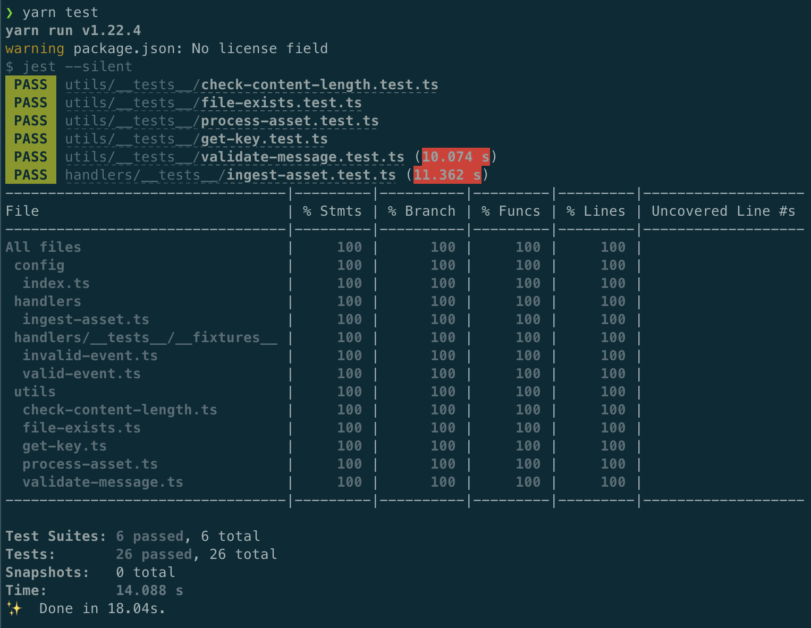
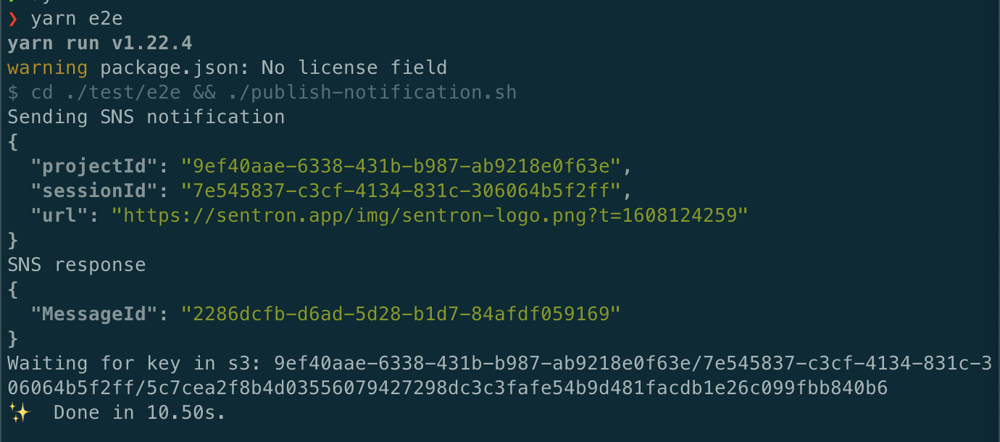

# sentron-asset-ingest

This service is responsible for parsing image/stylesheet assets from DOM mutation
events and storing them in S3 for use in session playback.

**NOTE to DD :dog:** This repo is an extract from the original source code, to give you a flavour of our TS lambda code 👍

## Setup

Make sure you have the following installed:

- Node 12.x
- Yarn 1.x

Then run `yarn` to install the required Node.js dependencies.

To deploy the app and run e2e tests you'll need a `sentron` profile setup in `~/.aws/credentials`.

## Testing

This service uses `jest` for unit testing. To run the tests/coverage report:

```
yarn test
```



There is also a **very** basic e2e test which you can run by using:

```
yarn e2e
```

**NOTE:** This tests against the `dev` bucket/topic so you'll need valid AWS credentials



## Deployment

This service is deployed to AWS using [Serverless](https://www.serverless.com/):

```
yarn deploy --stage=dev # or --stage=prod
```

Everything is currently hosted/stored in `eu-west-1`.

**NOTE to DD :dog:** If want to try deploying this service you'll need to change the bucket name so it's unique

## Logs

This service logs to Cloudwatch and log analysis is done using Cloudwatch Insights.
